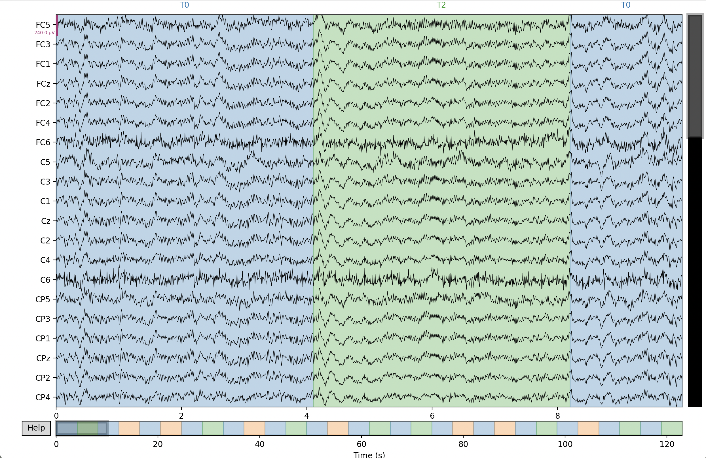
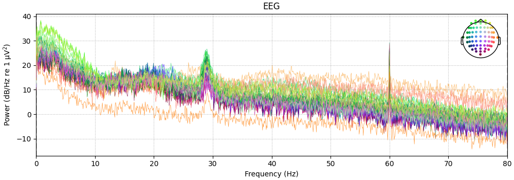
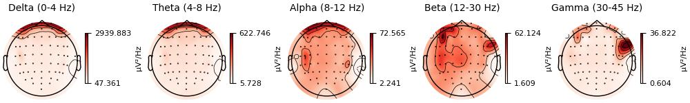
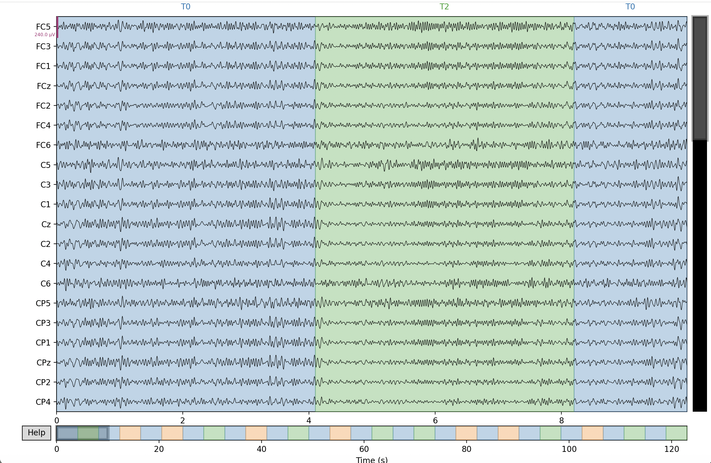
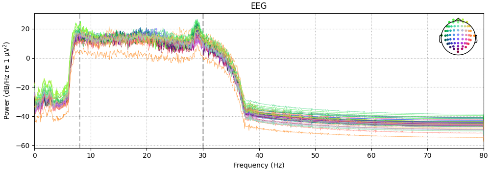
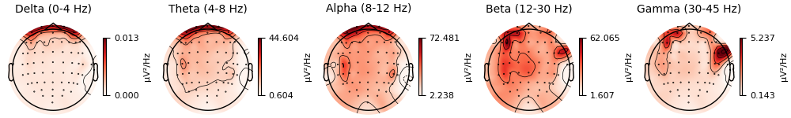
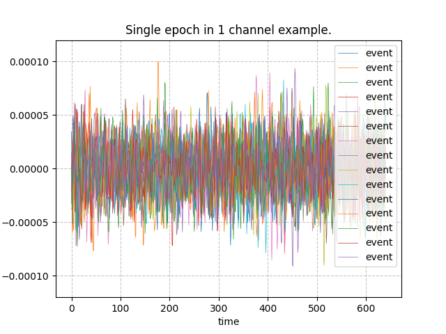
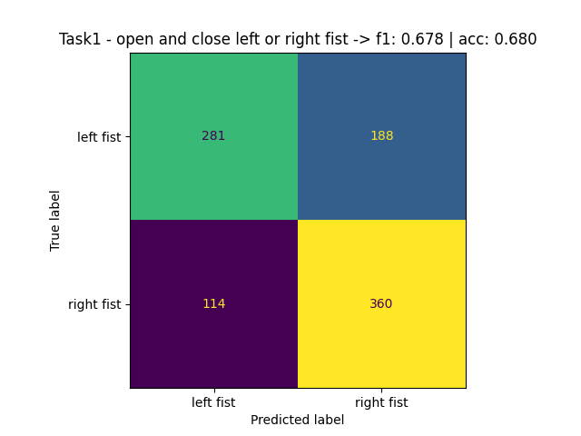

# Total-perspective-vortex

## Overview

A Brain-Computer Interface (BCI) pipeline that reads EEG brain signals and predicts what motor action a person is performing or imagining — such as moving their left hand or right hand.

**How it works in short**: When you think about moving your hand, specific regions of your brain produce measurable electrical patterns. EEG (electroencephalography) captures these signals through electrodes placed on the scalp. This project processes those signals and uses machine learning to classify which action the person intended.

The project consists of 4 parts:
- EEG data preprocessing and filtering
- Visualization of raw and processed signals
- Dimensionality reduction (CSP spatial filtering)
- Classification training and prediction


## Getting started

This project uses Python with MNE and scikit-learn. To set up the environment:

```bash
make

source venv/bin/activate
```

### Usage

**Training** (`train.py`):

```bash
# Train on all 4 tasks across all 109 subjects
python train.py dataset

# Train on a specific task (1-4)
python train.py dataset -t 1

# Train on a single subject
python train.py dataset -t 1 -s 17

# Use a specific config file
python train.py dataset -t 0 -c configs/config_mycsp_lda.json
```

**Prediction** (`predict.py`):

```bash
# Predict on a single edf file (task must match the run type)
python predict.py dataset/S089/S089R03.edf -t 1

# Realtime mode: simulate streaming prediction epoch by epoch
python predict.py dataset/S089/S089R03.edf -t 1 -r

# Use a specific config file
python predict.py dataset/S089/S089R03.edf -t 1 -c configs/config_mycsp_lda.json
```

## Background

**EEG (Electroencephalography)** measures the brain's electrical activity using electrodes placed on the scalp. When a person moves or imagines moving a body part, the brain produces detectable changes in specific frequency bands (8-30Hz). For example, imagining left hand movement causes changes primarily over the right side of the brain, and vice versa.

By capturing and analyzing these patterns, a machine learning model can decode what action the user is performing or intending — this is the core idea behind a Brain-Computer Interface.

## Dataset

The data comes from the [PhysioNet EEG Motor Movement/Imagery Dataset](https://physionet.org/content/eegmmidb/1.0.0/). 109 subjects were tested on 4 tasks across 14 runs, with 64 electrodes placed on the scalp capturing EEG signals.
Each subject performs one of two actions per task:

- Task 1 - open and close left or right fist
- Task 2 - imagine opening and closing left or right fist
- Task 3 - open and close both fists or both feet
- Task 4 - imagine opening and closing both fists or both feet

Each task is repeated 3 times (3 runs per task). The recordings are stored as `.edf` files (European Data Format), a standard format for EEG data.

The goal is to train a model that can predict which of the two actions the subject is performing, with a minimum mean accuracy of 60% across all 4 tasks on unseen data.


## EEG data preprocessing

We use the `mne` library to read `.edf` files. The raw EEG signal is noisy, containing power line interference, muscle artifacts, and brain activity outside the frequency range we care about.

The preprocessing pipeline applies the following steps in order:

1. **`mne.datasets.eegbci.standardize(raw)`** - Standardize channel names to a common naming convention
2. **`raw.pick("eeg")`** - Keep only EEG channels, remove other signal types
3. **`raw.notch_filter(60)`** - Remove 60Hz power line noise
4. **`raw.filter(8, 30)`** - Bandpass filter to keep only 8-30Hz, the frequency range most relevant to motor imagery
5. **`raw.resample(160)`** - Sample to 160Hz to keep data size
6. **`mne.Epochs()`** - Cut the continuous signal into segments (epochs) around each event, with a time window of [-1, 4]s and baseline correction
7. **`reject=dict(eeg=420e-6)`** - Drop epochs with abnormally large amplitude (likely artifacts)
8. **`epochs.crop(tmin=0, tmax=4)`** - Keep only the post-event period

### Visualization

We visualize the EEG signals before and after preprocessing to verify the effect of our filtering pipeline.

#### Raw EEG data

The unprocessed EEG signals from all channels, before any filtering.



Power spectrum of the raw signal showing signal strength at each frequency. The 60Hz power line noise is clearly visible as a spike.



Topographic map showing how signal power is distributed across the scalp at different frequency bands.



#### After bandpass filtering (8-30Hz)

After filtering, the signal is cleaned to keep only the 8-30Hz range relevant to motor imagery.



After filtering, the power spectrum shows energy concentrated in the 8-30Hz range, with the 60Hz noise removed.



The filtered topomap shows the remaining power focused in the 8-30Hz range, especially over the motor area of the brain (C3, Cz, C4).



#### Epoch

Each trial is cut into segments (epochs) around the event. Below is a single epoch across multiple channels, representing one motor imagery event.



## Dimensionality reduction

**Common Spatial Patterns (CSP)** is used for dimensionality reduction and feature extraction.

### Why CSP?

The raw EEG data for each trial has the shape `(64 channels, 641 time points)` — over 40,000 values. Feeding this directly to a classifier would be inefficient and noisy. We need a way to compress this into a small set of meaningful features.

CSP solves this by asking: *"What combination of channels best separates the two classes?"* Think of it as finding the best "viewing angle" of the brain data where the two types of actions look most different.

### How CSP works

1. For each class, compute how much the channels vary together (covariance matrix): `C = X @ X.T / n_times`
2. Find the directions (spatial filters) where one class has high signal power and the other has low power, by solving the generalized eigenvalue problem: `C0 @ W = lambda * C1 @ W`
3. Pick the top and bottom filters — these are the most discriminative directions
4. Project each trial through these filters: `X_filtered = W.T @ X`
5. Compute the log-variance of each filtered signal: `log(var(X_filtered))` — this gives a compact feature representing the signal power in each direction

The result: each trial is reduced from `(64, 641)` to a small feature vector of size `n_components` (e.g., 8 values), making classification much easier.

We implemented a custom `MyCSP` class compatible with sklearn's `Pipeline` and `BaseEstimator` API.


## Classification

The full pipeline is built using `sklearn.pipeline.Pipeline`:

```
EEG epoch (64, 641) -> CSP (n_components,) -> Classifier -> prediction (0 or 1)
```

### Classifiers tested

We tested the following classifiers from scikit-learn:

- **LDA** (`LinearDiscriminantAnalysis`): Finds the best linear boundary between two classes. Works well with CSP since both rely on the same kind of statistics (covariance).
- **Logistic Regression** (`LogisticRegression`): Linear model with regularization. We also implemented a custom version (`MyLogreg`) from scratch using gradient descent, compatible with the sklearn pipeline.
- **SVM** (`SVC`): Support vector machine with RBF kernel, good at finding non-linear boundaries.
- **XGBoost** (`XGBClassifier`): Ensemble of decision trees, a popular general-purpose classifier.
- **MLP** (`MLPClassifier`): A small neural network with two hidden layers (32, 16 neurons).

### Training procedure

- **Cross-subject**: 109 subjects split 80/20 by subject (not by individual trial, to avoid data leakage)
- **Single-subject**: 3 runs per task, one run held out as test set
- **Model selection**: 5-fold cross-validation on the training set, then retrain on the full training set with the best parameters
- **Hyperparameter tuning**: The number of CSP components (`n_components`) is searched over [6, 7, 8, 9, 10, 12, 14, 16] when enabled

### Results

n_components for CSP: task1=8, task2=10, task3=16, task4=22 (MLP uses n=64 for all tasks).

#### Baseline (sklearn CSP):

| classifier | task1 | task2 | task3 | task4 | mean |
|-----------|-------|-------|-------|-------|------|
| CSP + LDA | 0.687 | 0.650 | 0.648 | 0.654 | **0.659** |
| CSP + LogisticRegression | 0.683 | 0.626 | 0.650 | 0.656 | 0.654 |
| CSP + SVM | 0.655 | 0.627 | 0.634 | 0.645 | 0.640 |
| CSP + MLP (n=64) | 0.672 | 0.636 | 0.623 | 0.612 | 0.636 |
| CSP + XGBoost | 0.638 | 0.608 | 0.628 | 0.603 | 0.619 |

#### Custom implementation (MyCSP):

| classifier | task1 | task2 | task3 | task4 | mean |
|-----------|-------|-------|-------|-------|------|
| MyCSP + LDA | 0.680 | 0.636 | 0.643 | 0.651 | **0.653** |
| MyCSP + MyLogreg | 0.635 | 0.605 | 0.616 | 0.656 | 0.628 |

CSP + LDA achieved the best mean accuracy of 0.659 across all 4 tasks. Our custom MyCSP + LDA reaches 0.653, closely matching the sklearn baseline. LDA works well with CSP because both methods are based on similar linear algebra. More complex models (XGBoost, MLP) tend to overfit on this dataset due to limited training data.



### Prediction

The prediction script loads a trained model from a `.pkl` file and evaluates it on a given `.edf` file. It supports two modes:

- **Normal mode**: Loads all epochs from the `.edf` file, runs prediction on all of them at once, and outputs a classification report with a confusion matrix.
- **Realtime mode** (`-r`): Simulates a streaming BCI scenario. Epochs are predicted one by one with a time delay between each prediction, mimicking real-time brain-computer interface usage.